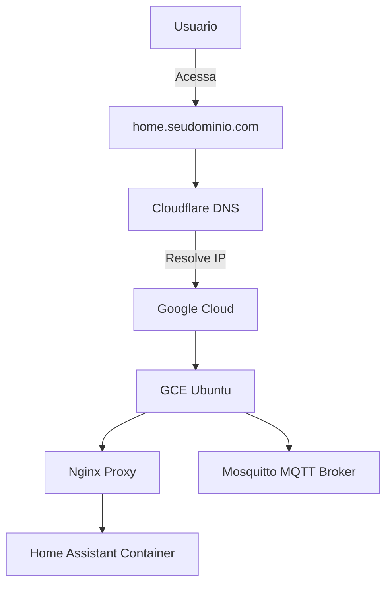
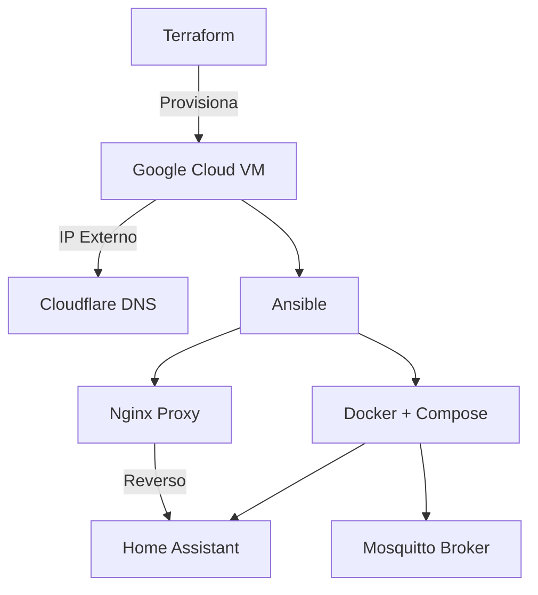

# 📊 Diagramas do Projeto Home-Hap

Este documento contém representações gráficas da arquitetura e fluxo de execução do projeto **Home-Hap**, utilizando a linguagem **Mermaid** compatível com GitHub.

---

## 🧭 Arquitetura da Infraestrutura Home-Hap

---

## 🧩 Visão Geral do Projeto Home-Hap

